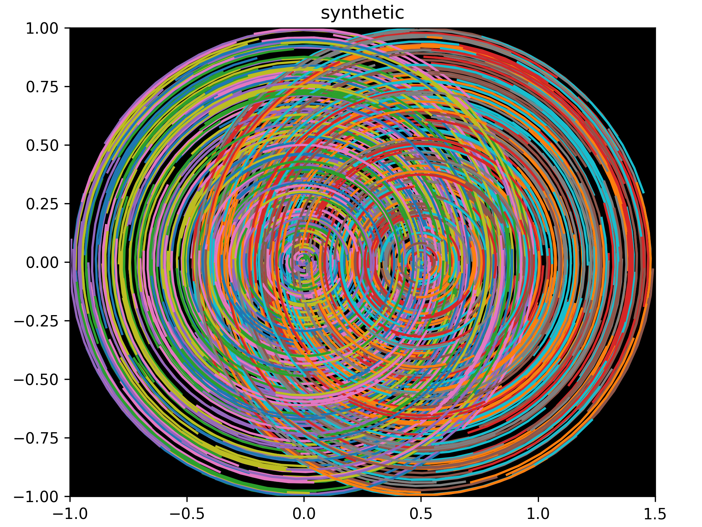
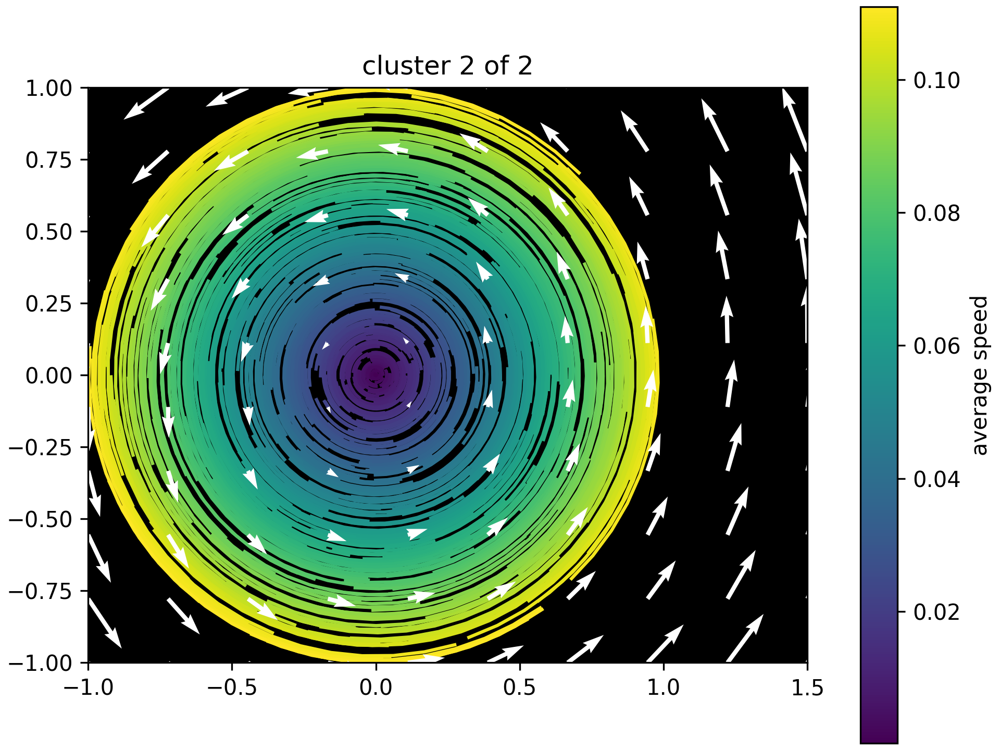
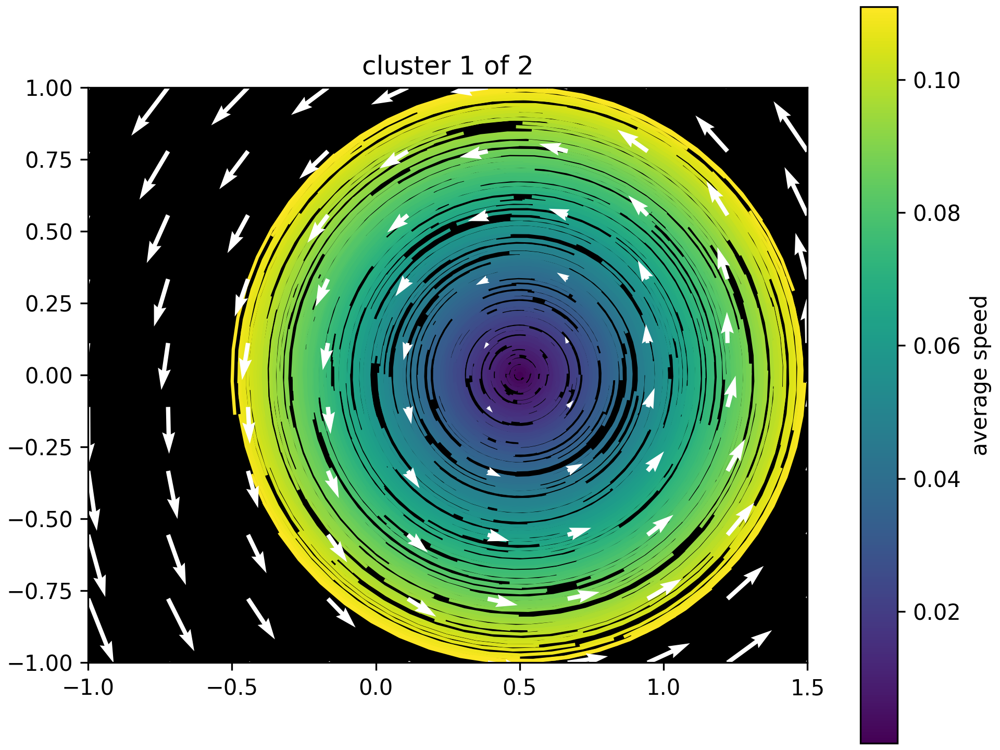
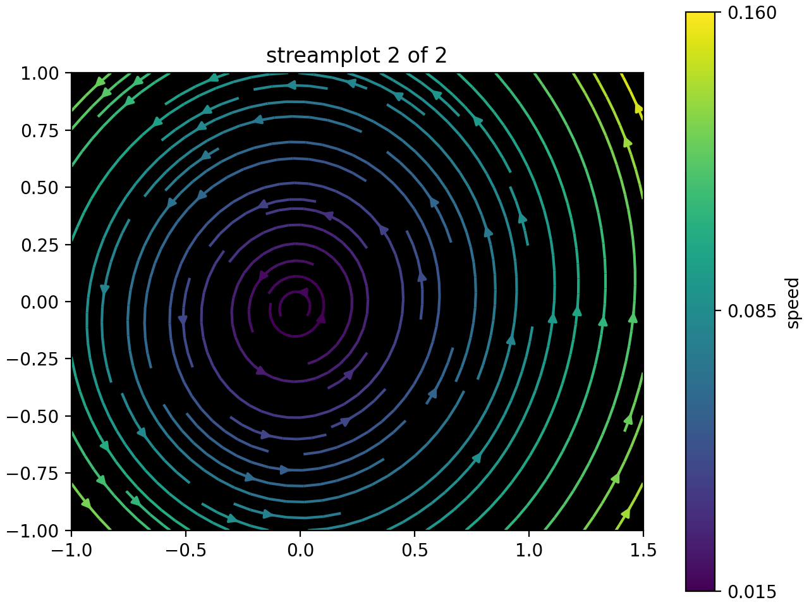
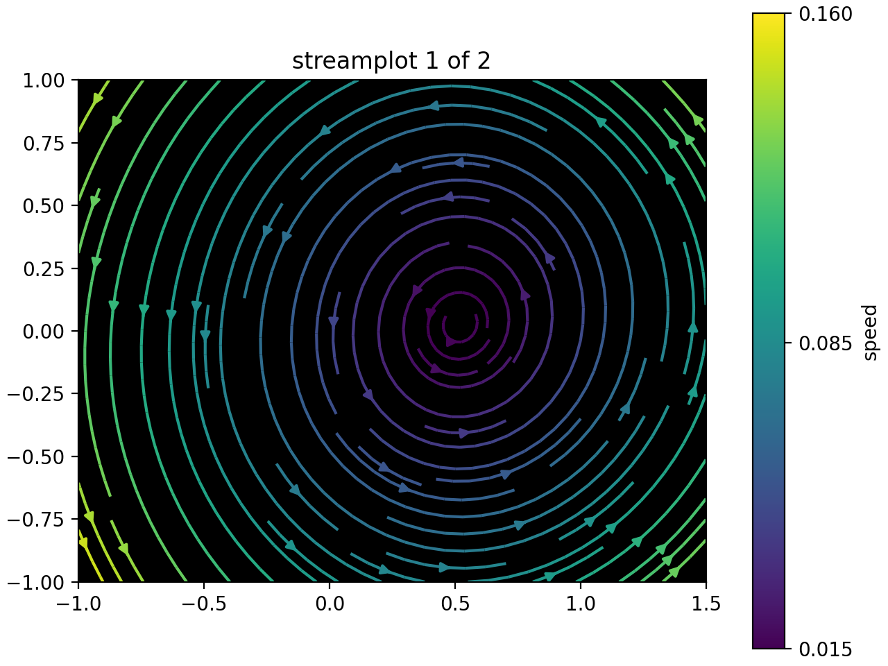

# Vector Field K-Means

This is a translation of the original VFKM algorithm from C++ to Python wich also includes new features as a Visualizer.

## (Adapted) abstract

> To understand trends in movement patterns, analyzing this data and discover more underlying patterns,
we introduce a novel technique which we call ***Vector-Field K-Means***.

> The central idea of our approach is to use vector fields to induce a similarity notion between trajectories.
Our approach is based on the premise that movement trends in trajectory data can be modeled as flows within multiple vector fields,
and the vector field itself is what defines each of the clusters.
We also show how VFKM connects techniques for scalar field design on meshes and k-means clustering.
We present an algorithm that finds a locally optimal clustering of trajectories into vector fields,
and demonstrate how vector-field k-means can be used to mine patterns from trajectory data.

- (Adapted) abstract from [Vector Field k-Means: Clustering Trajectories by Fitting Multiple Vector Fields](https://arxiv.org/pdf/1208.5801)

## DEMO

### DataSet

### Clusters found

  
  

### Streamplots

  
  

